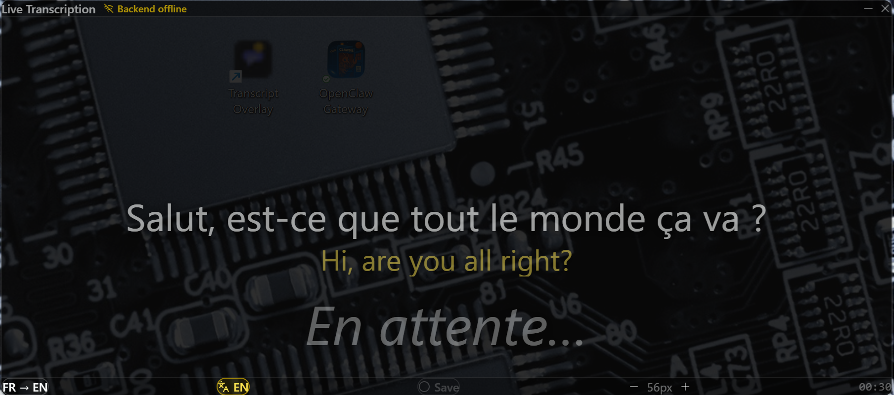

# Transcript Overlay

A lightweight desktop overlay for **real-time speech transcription and translation**. Built with [Tauri](https://tauri.app/), React, and the Web Speech API.



## Features

- 🎤 **Real-time transcription** — Uses the Web Speech API for accurate speech-to-text
- 🌐 **Multi-language support** — French, English, and Portuguese (easily extensible)
- 🔄 **Live translation** — Translate between any supported languages in real-time
- 📌 **Always-on-top** — Stays visible over other windows, perfect for presentations
- 🖥️ **Multi-monitor** — Drag freely across displays
- 🎨 **Minimal UI** — Dark, semi-transparent design that doesn't distract
- 📝 **Adjustable font size** — Scale text from 32px to 96px
- 💾 **Optional backend recording** — Save transcripts to a database (requires backend)

## Installation

### Download

Download the latest installer from [Releases](../../releases):
- **Windows**: `.msi` (recommended) or `.exe` (portable setup)

### Build from Source

Requirements:
- [Node.js](https://nodejs.org/) 18+
- [Rust](https://rustup.rs/) 1.70+
- [Tauri CLI](https://tauri.app/v1/guides/getting-started/prerequisites)

```bash
# Clone the repository
git clone https://github.com/carlosdenner/transcript-overlay.git
cd transcript-overlay

# Install dependencies
npm install

# Run in development mode
npm run tauri dev

# Build for production
npm run tauri build
```

## Usage

1. **Launch the app** — It opens as a floating overlay
2. **Select languages** — Use the dropdowns to set source (speech) and target (translation) languages
3. **Start speaking** — Transcription begins automatically
4. **Toggle translation** — Click the language badge to show/hide translations
5. **Resize text** — Use +/- buttons to adjust font size
6. **Move the window** — Drag the top bar to reposition
7. **Minimize** — Click the minimize button to hide to system tray

### Controls

| Control | Action |
|---------|--------|
| `[FR ▼] → [EN ▼]` | Select source and target languages |
| `🌐 EN` | Toggle translation visibility |
| `⚫ Save` | Record transcript to backend (if connected) |
| `- 56px +` | Adjust font size |
| `—` | Minimize to system tray |
| `×` | Close application |

## Configuration

Language preferences and font size are automatically persisted to localStorage.

### Adding Languages

Edit `src/components/LiveTranscriptionOverlay.tsx`:

```typescript
const LANGUAGES: Record<SpeechLang, { label: string; short: string; code: string }> = {
  'fr-FR': { label: 'French', short: 'FR', code: 'fr' },
  'en-US': { label: 'English', short: 'EN', code: 'en' },
  'pt-BR': { label: 'Portuguese', short: 'PT', code: 'pt' },
  // Add more languages here
};
```

The app uses:
- **Web Speech API** for speech recognition (supports [many languages](https://cloud.google.com/speech-to-text/docs/speech-to-text-supported-languages))
- **MyMemory Translation API** for translations (free, no API key required)

## Tech Stack

- **[Tauri 2.x](https://tauri.app/)** — Lightweight native app framework (~3MB vs Electron's 150MB+)
- **[React 19](https://react.dev/)** — UI library
- **[Vite](https://vitejs.dev/)** — Fast build tool
- **[Tailwind CSS 4](https://tailwindcss.com/)** — Utility-first CSS
- **[TypeScript](https://typescriptlang.org/)** — Type safety
- **[Rust](https://rust-lang.org/)** — Backend runtime and system tray

## Requirements

- **Windows 10/11** with WebView2 (pre-installed on Windows 11)
- **Microphone access** — Required for speech recognition
- **Internet connection** — Required for translation API

## License

MIT License — see [LICENSE](LICENSE) for details.

## Contributing

Contributions are welcome! Please open an issue or submit a pull request.

## Recommended IDE Setup

- [VS Code](https://code.visualstudio.com/) + [Tauri](https://marketplace.visualstudio.com/items?itemName=tauri-apps.tauri-vscode) + [rust-analyzer](https://marketplace.visualstudio.com/items?itemName=rust-lang.rust-analyzer)

---

Made with ❤️ for educators and presenters who need real-time captioning and translation.
